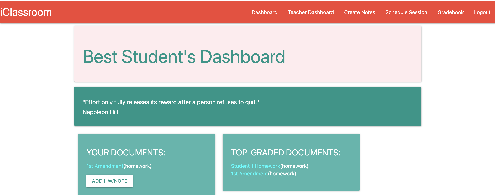
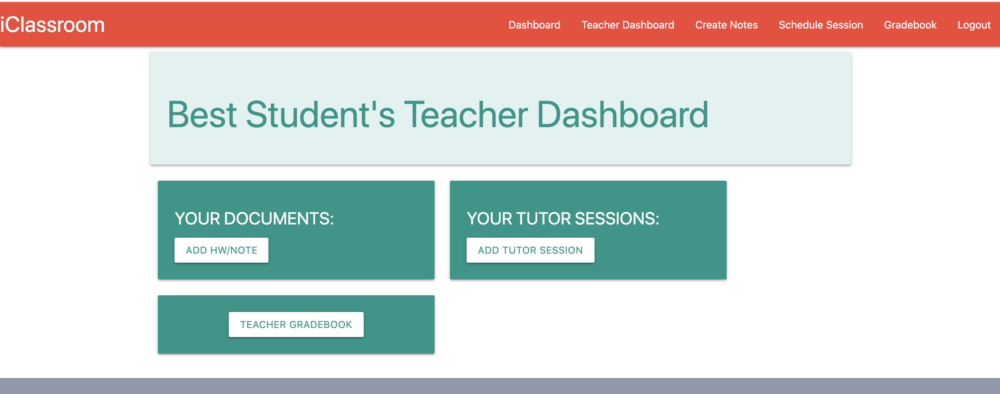
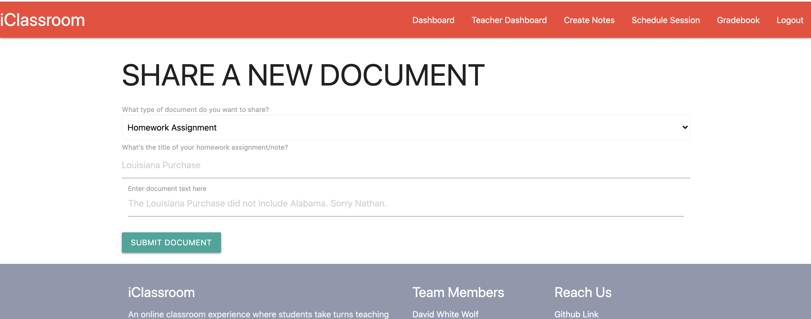
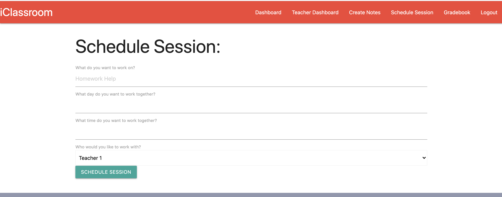
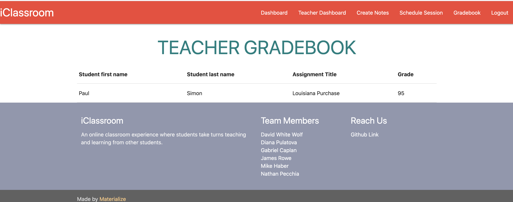

## Project Title

iClassroom

## Description

As schools begin to reopen during an uncertain pandemic, the look of classrooms and how they operate are constantly having to adjust to a new normal. This requires new ideas, technologies and methods of learning - which can be difficult! It also allows the opportunity to level the playing field for many students by opening their resources to learn and quality of education to more than their specific school system or geographic location. This program will help connect students within a classroom (and beyond!) to other students who can share their notes, work together on assignments, and teach each other. This is part note taker, part tutor, part social media site. “By teaching, we learn."

## Getting Started

Begin by navigating to the Herokup link provided below. You will be asked if you'd like to sign-up or log-in to iClassroom.

When signing up, you will be asked if you are a student or a teacher. If you are a student, you will be able to select the name of your teacher.

Once logged-in, you will be able to view your personalized dashboard. Here you can view all of your homework documents and tutor sessions, as well creating new ones. To submit a new document or schedule a new tutoring session, click the appropriate button to be navigated to the appropriate form. You will also see a column of high-scoring documents from all of your classmates on the dashboard page - these are helpful to learn with!

If you log in as a teacher, your dashboard will also render documents and tutor sessions, as well as a button to your gradebook.

# Links:

[iClassroom Heroku](https://classroomhelper.herokuapp.com/)

[Github Repo](https://github.com/jamesrowe1/project2/projects/)

## Screenshots

## Team Members

- **James Rowe** (https://github.com/jamesrowe1)
- **Mike Habor** (https://github.com/miike7687)
- **Nathan Pecchia** (https://github.com/SeptumPrince)
- **Diana Pulatova** (https://github.com/dianapulatova)
- **Gabriel Caplan** (https://github.com/GCaplan777)
- **David White Wolf** (https://github.com/karur0su)

# List of technologies used

VSCode, Node.js (Express.js, Passport.js, Bcrypt.js, Sequelize.js), mySQL, GitHub (hosting code), Heroku (hosting deployed application

## License

Licensed under iClassroom L.L.C. (not a real company)

## Troubleshooting

For any issues contact members of the team (GitHub accounts above)

## Acknowledgments

- Ben Wright
- Justin Pinero
